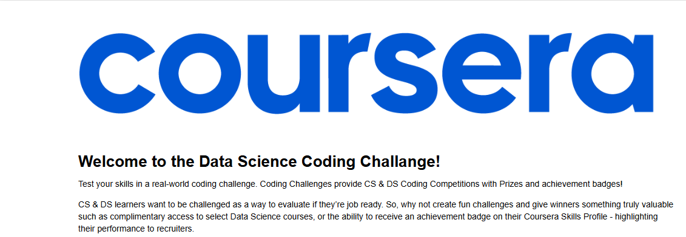

# **Project Mahcine learning**

## Obejctif

The goal of this project is to **predict customer churn** for a video streaming service using machine learning. As a data scientist at the company, you are tasked with building a model that can forecast which existing subscribers will continue their subscriptions for another month. The model aims to identify high-risk subscribers, allowing the company to deploy interventions to retain them. The challenge involves analyzing a dataset of subscribers from 2021 to predict the likelihood of churn before cancellations occur.

### Techniques Used:
1. **Data Exploration and Preprocessing**:
   - Loaded and explored the dataset to understand the structure.
   - Filtered relevant features such as `AccountAge`, `SubscriptionType`, `Gender`, `CustomerID`, and `Churn`.
   - Encoded categorical variables and standardized numerical features using `LabelEncoder` and `StandardScaler`.

2. **Data Visualization**:
   - Visualized the distribution of `AccountAge` based on `Gender` and `SubscriptionType` to understand patterns in the data.
   - Used histograms and facet grids to gain insights into the dataset.

3. **Model Building**:
   - Split the data into training and test sets using `train_test_split`.
   - Trained a **Logistic Regression** model to predict customer churn based on the selected features.
   - Used `LogisticRegression` from scikit-learn to make predictions and assess model performance.

4. **Model Evaluation**:
   - Evaluated the model using a **confusion matrix** and **classification report** to understand its accuracy and precision.
   - Predicted churn probabilities and analyzed the alignment of predictions with actual outcomes.

### Highlights and Business Impact:
- **Churn Prediction**: The model successfully predicted which subscribers were at the highest risk of canceling their subscriptions, which is crucial for reducing churn and improving customer retention.
- **Resource Allocation**: By identifying high-risk customers, the company can allocate resources more effectively, targeting the right customers with interventions (e.g., offers, content recommendations, etc.).
- **Industry Relevance**: The solution applies machine learning to an industry-relevant problem, demonstrating the value of data science in optimizing subscription-based business models.

## CONCLUSION 
To complete the project, I followed these steps:

1. **Data Loading & Exploration**: Loaded and explored the data to understand its structure and identify relevant columns.
2. **Data Preprocessing**: Cleaned the data by filtering columns, converting data types, and standardizing features.
3. **Visualization**: Used visualizations to explore the distribution of data and identify patterns.
4. **Model Building**: Built a logistic regression model to predict churn, using `CustomerID` as the feature and `Churn` as the target.
5. **Evaluation**: Evaluated the model using confusion matrix, classification report, and visualized performance.
6. **Prediction & Result Generation**: Generated predictions and compiled them into a final DataFrame for analysis.

The solution predicts churn, providing actionable insights to reduce customer churn.
[link](https://github.com/Cetaking27/Certification-Project/blob/master/Project_1/challenge_project.ipynb)
